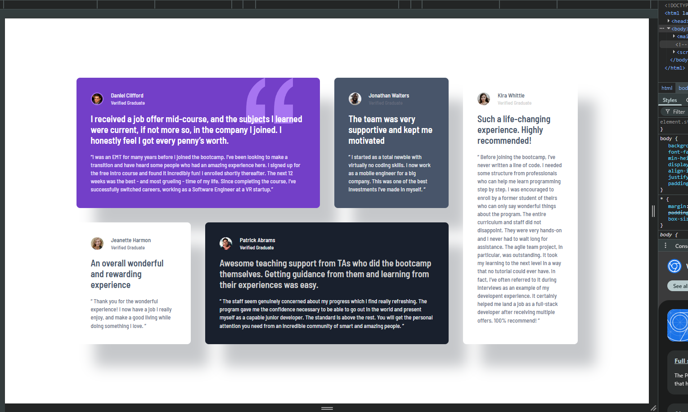
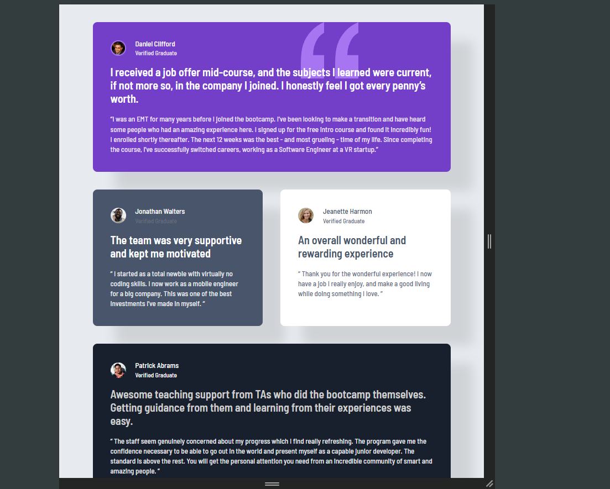
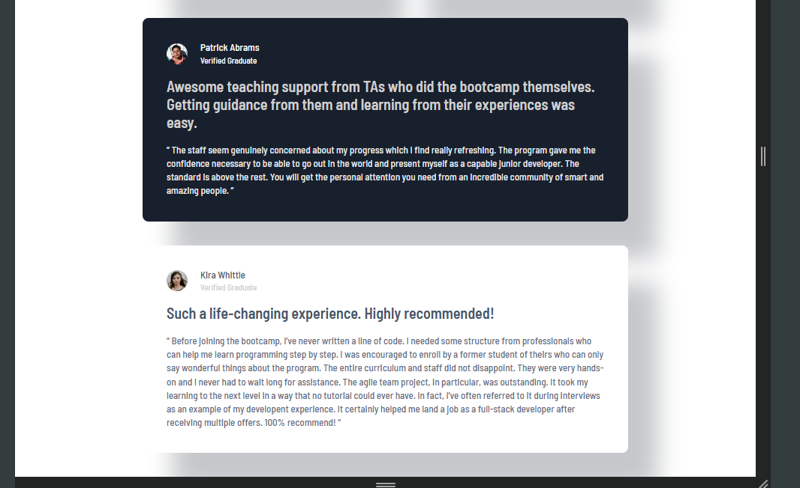
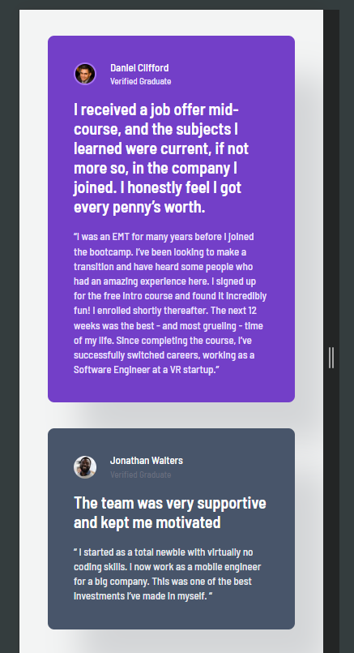
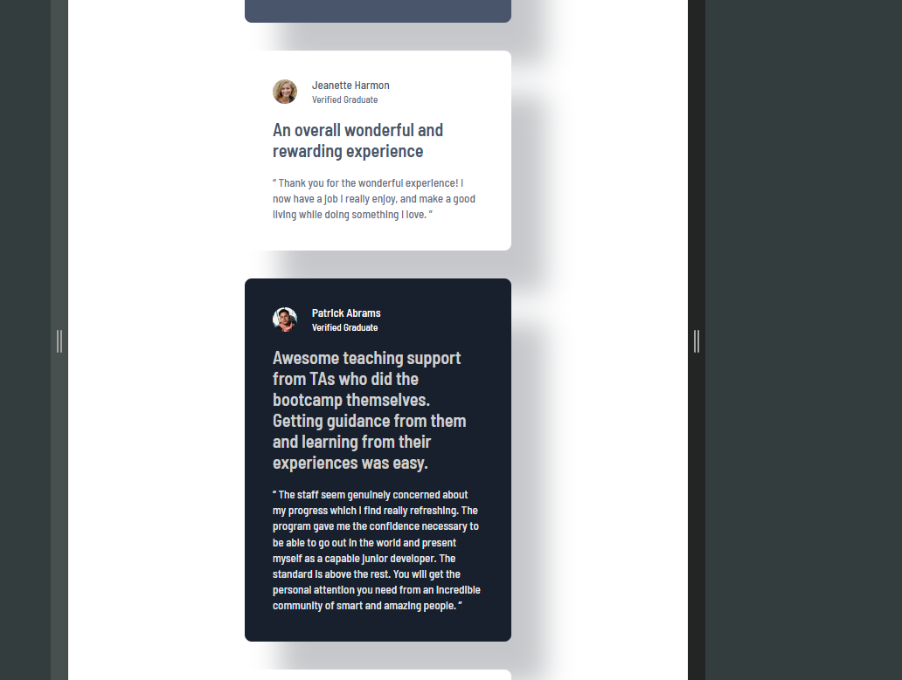
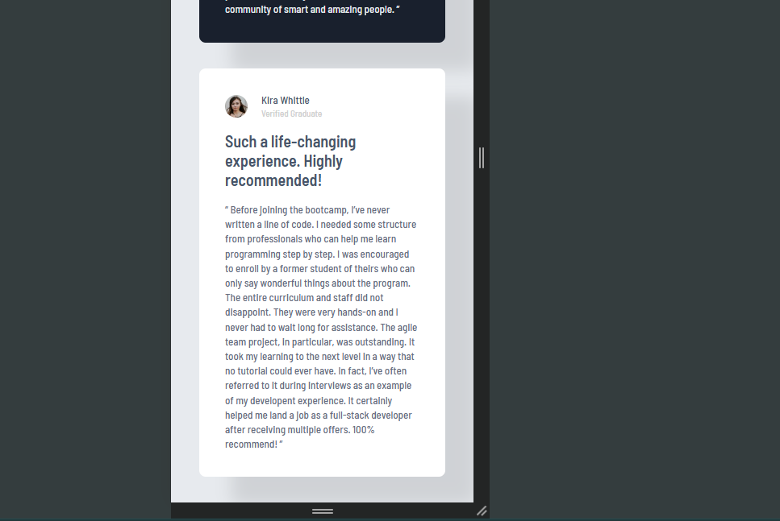

# Frontend Mentor- Testimonials Grid Section - Solução

Essa é uma solução para o desafio [Testimonials Grid Section](https://www.frontendmentor.io/learning-paths/building-responsive-layouts--z1qCXVqkD/challenge/65e71e1c17e502f0b6ce64b3/start). Os desafios do Frontend Mentor nos ajuda a melhorar a habilidade com o desenvolvimento front-end.

### Versões do projeto
- Desktop

  
- Tablet

- Mobile

##
### Links
- Repositório: [solução](https://github.com/jose-wolf/testimonials-grid-section)
- Site URL: [site do desafio](https://fourcardfeaturesectionproject.netlify.app/)

### O que eu aprendi?
- Css grid
- Responsividade.
- Controle de tamanho e alinhamento.

O objetivo é utilizar cada vez mais o css grid, para que possa aprende-lo melhor.

## Author

- LinkedIn - [José Wolf](https://www.linkedin.com/in/jose-wolf)
- Frontend Mentor - [@jose-wolf](https://www.frontendmentor.io/profile/jose-wolf)
